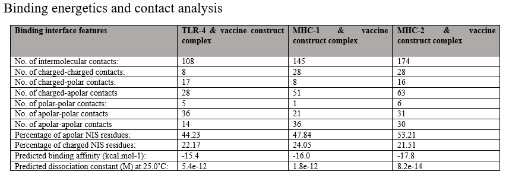

# COMPUTATIONAL BASED MULTI-EPITOPE VACCINE DESIGN AGAINST ZIKA VIRUS

Kavya Gopal Bhat1*, Ramachandra Prasad1 

1School of Life Sciences, 1Department of Life Sciences, Garden City University, Bangalore, India

*Corresponding author (bhatkavya763@gmail.com)
 

**ABSTRACT**

The Zika virus (ZIKV), primarily transmitted by Aedes mosquitoes, can also spread through blood, sexual contact, or from a mother to her baby. While most infections are either mild or show no symptoms, possible symptoms can include fever, rash, and joint pain. In more severe instances, it may lead to Guillain-Barré syndrome in adults and congenital defects such as microcephaly in infants. A multi-epitope vaccine was specifically developed utilizing three ZIKV proteins—Envelope (E), NS1, and NS3 selected for their importance in immunology and their structural availability.
The identification of T- and B-cell epitopes was conducted using IEDB; the antigenicity (VaxiJen), toxicity (ToxinPred), and allergenicity (AllerTOP) of MHC I/II epitopes were evaluated, with population coverage verified through IEDB; the chosen epitopes were connected with AAY (for MHC-I) and GPGPG (for MHC-II), and a β-defensin adjuvant was incorporated at the N-terminus.
The physicochemical characteristics of the vaccine demonstrated its stability and solubility. The prediction of its 3D structure was performed using AlphaFold2 and was subsequently validated with a Ramachandran plot. Discontinuous B-cell epitopes were detected from the refined 3D model to pinpoint regions that are accessible to antibodies based on their conformation.
Molecular docking studies with MHC I, MHC II, and TLR4 evaluated binding affinity, complemented by MD simulations for assessing complex stability. After validating the structure and analysing interactions, codon optimization and in silico cloning were performed to guarantee effective expression in E. coli K12.
The multi-epitope vaccine design demonstrated positive structural and immune characteristics, indicating its promise as a candidate for a Zika virus vaccine for further evaluation.
Keywords: Zika virus, multi-epitope vaccine, Envelope(E) protein, NS1 protein, Serine protease NS3, MHC epitope prediction, Molecular docking, Molecular dynamics simulation. 
 
**Introduction**

In recent years, the Zika virus (ZIKV) has been spreading widely across the globe. The impact of this infection differs from person to person. To gain a better understanding of this, research is being conducted to assess the effects of the disease(1).  The disease is quickly spreading through several methods, including sexual transmission, from mother to baby during childbirth, and through the transfusion of contaminated blood products, with the primary route of transmission to humans being mosquito bites(2). Zika virus infections in older children and adults often do not show symptoms or result in mild illness. When contracted during pregnancy, it can lead to serious negative effects, including a higher chance of premature birth, fetal death and stillbirth, as well as congenital abnormalities that are collectively recognized in their most severe manifestation as congenital Zika syndrome(3). The Zika virus possesses a distinct ability to exploit the host's biological systems to boost its replication in a tissue-specific way, resulting in pathological consequences. Recent studies have suggested that the Zika virus exhibits evasion and tropism characteristics, allowing it to avoid detection by immune cells and induce serious disease, while also facilitating its entry into new host cells(4).

 The engagement of ZIKV with various pathways in the human host ultimately influences effective virus replication and the resulting pathogenesis associated with ZIKV; nonetheless, the molecular mechanisms behind these host-ZIKV interactions are only beginning to be uncovered(3).

 Since effective treatments are currently lacking and infections are frequently asymptomatic, there is an urgent necessity for a preventive vaccine. DNA vaccines have been shown to be both safe and able to provoke immune responses for numerous pathogens, including flaviviruses. Different vaccines could be tailored for specific target groups, eliciting various immune response types and differing durations of effectiveness. As collaborative efforts progress and our understanding of the immune response to the Zika virus increases, the guidance for formulating a conclusive response to the epidemic will enhance(5).

 Developing an epitope vaccine for the Zika virus is more cost-effective, quicker, and requires less labour, making it simpler to produce and distribute. It is also highly immunogenic and can offer sustained protection while causing minimal side effects; therefore, it represents a safe and efficient strategy for creating a vaccine against the Zika virus(6).Vaccines developed through pasture vaccinology have significantly advanced vaccine technology, yet this methodology often encounters failure due to factors such as the cultivation of various pathogenic viruses and the transmission of their associated diseases(7).

 Additionally, it is evident that a significant obstacle in vaccine development is the identification of suitable vaccine candidates in pathogenic microorganisms(7). Moreover, immunologists need to spearhead the creation of multi-epitope-based vaccine designs due to the challenges in preventing disease outbreaks and protecting the elderly population, along with the availability of computer-assisted vaccine design tools(8).

 Epitope vaccines comprise MHC-restricted epitopes that are identifiable by immune cells from various B-cell clones, as well as B-cell-derived T-cell epitopes that can trigger effective immune responses against specific pathogens and ensure prolonged immunity(9).

Multi-epitopes are seen as a promising strategy for combating tumors and viral infections. A vaccine consisting of multiple overlapping peptides presents a promising strategy for both preventing and treating tumors or viral infections. Multi-epitope vaccines effectively elicit strong, targeted humoral and cellular immune responses, resulting in robust immune responses for each individual epitope contained within the vaccine(10). Multi-epitope-based vaccine designs offer numerous benefits, making them an effective approach for preventive and therapeutic solutions against tumors, bacterial infections, and viral diseases(11). Consequently, the present study has employed various bioinformatics, immunoinformatics, and biophysical strategies to develop a multi-epitope-based vaccine construct targeting the Zika virus and its associated health challenges.

**Methodology**

**Figure 1: Schematic workflow of the computational vaccine design.**

The research methodology follows this sequence: (1) retrieval of protein sequences from chosen Zika virus proteins; (2) prediction and screening of epitopes considering factors like antigenicity, toxicity, and allergenicity; (3) analysis of population coverage; (4) design of the vaccine construct incorporating linker and adjuvant; (5) Physicochemical properties analysis; (6) prediction of the three-dimensional structure of the construct; (7) prediction of discontinuous B-cell epitopes; (8) molecular docking studies with immune receptors; (9) molecular dynamics simulations for structural evaluation; (10) optimization of codons and in silico cloning into an appropriate expression vector.

**2.1	Protein sequence retrieval**

Amino acid sequences for the Zika virus Envelope (E) protein (residues 291–790), Non-Structural Protein 1 (NS1, residues 791–1142), and Serine Protease NS3 (residues 1499–2115) were obtained from the complete polyprotein sequence (UniProt ID: Q32ZE1) by identifying cleavage sites and were retrieved in FASTA format from the UniProt database(12) Envelope (E), NS1, and NS3 proteins were selected as Zika vaccine targets for their roles in pathogenesis. E enables host entry and is a key neutralizing antibody target, NS1 aids immune evasion and replication, and NS3 processes polyproteins and triggers strong T-cell responses, making them essential for viral survival and immune recognition.(13).

**2.2 Epitope prediction and screening**

We utilized immunoinformatics tools to predict T-cell and B-cell epitopes. For T-cell epitope predictions (MHC-1 and MHC-2), we employed tools from the Immune Epitope Database (IEDB)(14) to analyse binding, selecting epitopes based on their strong binding affinity to common HLA alleles. 

All predicted epitopes underwent evaluation for antigenicity using the VaxiJen server(15), toxicity screening via the ToxinPred server(16), allergenicity was assessed with AllerTOP v.2.0(17), the IFN-γ prediction tool was used to assess immunogenicity (18). Furthermore, the population coverage analysis using the IEDB Population Coverage tool to ensure adequate HLA representation across varied global populations(19). Epitopes were selected for high antigenicity, non-toxicity, non-allergenicity, positive immunogenicity, and broad population coverage, confirming their suitability for the multi-epitope vaccine(20).

**2.3 Vaccine construct design**

The multi-epitope vaccine combined epitopes from Envelope, NS1, and NS3 proteins. A β-defensin adjuvant at the N-terminus boosts immunogenicity and innate immunity, linked to the PADRE sequence via an EAAAK linker for stability and domain separation(21).Helper T lymphocyte (HTL) epitopes were linked using GPGPG linkers to preserve their individual immunogenic properties and ensure effective MHC class II presentation(22). CTL epitopes were linked with AAY linkers for proteasomal processing and MHC I presentation, with HTL and CTL segments arranged sequentially after the PADRE sequence(23). B-cell epitopes were added to the C-terminus using KK linkers to prevent conformational interference, ensuring proper folding, spatial separation, and exposure to the immune system. (24).

**2.4 Physicochemical property analysis**

The SoluProt tool was utilized to assess the potential for soluble expression in Escherichia coli(25). After evaluating solubility, the ProtParam tool was employed to calculate essential physicochemical properties of the vaccine, including its molecular weight, theoretical isoelectric point (pI), aliphatic index, instability index, and grand average of hydropathicity (GRAVY). (26).The PSIPRED tool was utilized to predict the secondary structure of the designed multi-epitope vaccine construct, as it is well-known for its high precision in identifying secondary structure components based on position-specific scoring matrices. (27).

**2.5 3D structure prediction and validation**

The three-dimensional (3D) conformation of the completed multi-epitope vaccine construct was initially forecasted using AlphaFold, an advanced deep learning-based algorithm for predicting protein structures(28). The predicted model was subsequently enhanced using the GalaxyRefine module from the GalaxyWEB server, which improves structural quality by refining side-chain arrangements and overall geometry(29).

The top-refined structure was chosen based on structure quality metrics and was additionally validated using the SAVES v6.0 server. This structural validation involved PROCHECK analysis to assess backbone dihedral angles via Ramachandran plots and ERRAT analysis to evaluate non-bonded atomic interactions. The combined validation confirmed that the final refined model was stereo chemically stable and appropriate for further computational studies(30).

**2.6 Discontinuous B-cell epitope prediction**

Discontinuous (conformational) B-cell epitopes were identified by utilizing the Ellipro server, which detects conformational B-cell epitopes by analysing the shape and solvent accessibility of the 3D model. (31).

Immune simulation with the C-ImmSim server mimics host immune reactions to antigen exposure using agent-based algorithms. The tool replicates the activation of B-cells and T-cells, the release of cytokines, and the formation of memory cells. This phase forecasts the potential of the construct to induce both humoral and cellular immune responses in silico(32).

**2.7 Molecular docking**

Molecular docking assesses how the vaccine construct interacts with immune receptors through the HADDOCK web server. The optimized three-dimensional structure of the vaccine is docked with MHC class I, MHC class II, and TLR4 receptors to estimate the binding orientation and affinity(33). HADDOCK utilizes a data-driven methodology that integrates biochemical and biophysical data to create docked complexes. The top-ranking models are chosen based on the HADDOCK score(34).

**2.8 Molecular Dynamics simulation**

Molecular dynamics simulations were conducted using GROMACS to evaluate the stability and dynamic characteristics of the vaccine–receptor complex within a simulated physiological environment. The complex was prepared by placing it in a water box for solvation, adding counterions, and then performing energy minimization followed by equilibration. A production run was subsequently carried out to observe structural fluctuations and the overall behaviour of the system. Key metrics such as root mean square deviation (RMSD), root mean square fluctuation (RMSF), and radius of gyration were analysed to assess the flexibility and compactness of the complex(35).

**2.9 Codon optimization and in silico cloning**

The final vaccine construct underwent codon optimization, utilizing the JCat server to modify the nucleotide sequence for effective expression in Escherichia coli K12. This tool modified the codon usage while steering clear of conflicts with prokaryotic ribosome binding sites, as well as avoiding restriction sites and motifs that might lead to mRNA instability. The optimized sequence was subsequently incorporated into the pET28a(+) expression vector through SnapGene software. To ensure proper insertion, orientation, and compatibility with the vector system, restriction sites were included at both ends(36).

**RESULTS**

**3.1 Protein sequence retrieval**

The amino acid sequences for three target proteins—Envelope (E), Non-Structural Protein 1 (NS1), and Non-Structural Protein 3 (NS3)—associated with the Zika virus were obtained from the UniProt database (UniProt ID: Q32ZE1). These proteins were chosen for their critical functions in viral entry, immune evasion, and replication. Each sequence was sourced from the complete polyprotein based on their established locations in the polyprotein annotation. Following are the extracted FASTA sequences:

**Envelope (E) Protein: Residues 291–790**

>Zika_E_protein 
PAYSIRCIGVSNRDFVEGMSGGTWVDVVLEHGGCVTVMAQDKPTVDIELVTTTVSNMAEVRSYCYEASISDMASDSRCPTQGEAYLDKQSDTQYVCKRTLVDRGWGNGCGLFGKGSLVTCAKFTCSKKMTGKSIQPENLEYRIMLSVHGSQHSGMIGYETDEDRAKVEVTPNSPRAEATLGGFGSLGLDCEPRTGLDFSDLYYLTMNNKHWLVHKEWFHDIPLPWHAGADTGTPHWNNKEALVEFKDAHAKRQTVVVLGSQEGAVHTALAGALEAEMDGAKGRLFSGHLKCRLKMDKLRLKGVSYSLCTAAFTFTKVPAETLHGTVTVEVQYAGTDGPCKIPVQMAVDMQTLTPVGRLITANPVITESTENSKMMLELDPPFGDSYIVIGVGDKKITHHWHRSGSTIGKAFEATVRGAKRMAVLGDTAWDFGSVGGVFNSLGKGIHQIFGAAFKSLFGGMSWFSQILIGTLLVWLGLNTKNGSISLTCLALG

**NS1 Protein: Residues 791–1142**

>Zika_NS1
GVMIFLSTAVSADVGCSVDFSKKETRCGTGVFIYNDVEAWRDRYKYHPDSPRRLAAAVKQAWEEGICGISSVSRMENIMWKSVEGELNAILEENGVQLTVVVGSVKNPMWRGPQRLPVPVNELPHGWKAWGKSYFVRAAKTNNSFVVDGDTLKECPLEHRAWNSFLVEDHGFGVFHTSVWLKVREDYSLECDPAVIGTAVKGREAAHSDLGYWIESEKNDTWRLKRAHLIEMKTCEWPKSHTLWTDGVEESDLIIPKSLAGPLSHHNTREGYRTQVKGPWHSEELEIRFEECPGTKVYVEETCGTRGPSLRSTTASGRVIEEWCCRECTMPPLSFRAKDGCWYGME

**NS3 Protein: Residues 1499–2115**

>zika_NS3
CGMNPIAIPFAAGAWYVYVKTGKRSGALWDVPAPKEVKKGETTDGVYRVMTRRLLGSTQVGVGVMQEGVFHTMWHVTKGAALRSGEGRLDPYWGDVKQDLVSYCGPWKLDAAWDGLSEVQLLAVPPGERARNIQTLPGIFKTKDGDIGAVALDYPAGTSGSPILDKCGRVIGLYGNGVVIKNGSYVSAITQGKREEETPVECFEPSMLKKKQLTVLDLHPGAGKTRRVLPEIVREAIKKRLRTVILAPTRVVAAEMEEALRGLPVRYMTTAVNVTHSGTEIVDLMCHATFTSRLLQPIRVPNYNLNIMDEAHFTDPSSIAARGYISTRVEMGEAAAIFMTATPPGTRDAFPDSNSPIMDTEVEVPERAWSSGFDWVTDHSGKTVWFVPSVRNGNEIAACLTKAGKRVIQLSRKTFETEFQKTKNQEWDFVITTDISEMGANFKADRVIDSRRCLKPVILDGERVILAGPMPVTHASAAQRRGRIGRNPNKPGDEYMYGGGCAETDEGHAHWLEARMLLDNIYLQDGLIASLYRPEADKVAAIEGEFKLRTEQRKTFVELMKRGDLPVWLAYQVASAGITYTDRRWCFDGTTNNTIMEDSVPAEVWTK

**3.2 Epitope prediction and screening**

B-cell, MHC Class I (CTL), and MHC Class II (HTL) epitope predictions were carried out using the analysis tools offered by the Immune Epitope Database (IEDB) resource.
B-cell epitopes were discovered by examining properties based on sequences and structural characteristics. The graphs produced during the prediction process were assessed to choose areas with significant antigenic potential.

 

**Figure 2: graphical representation of B-cell epitope prediction.**

The yellow color represents moderate scoring region of B-cell peptides generated by the Immune Epitope Database (IEDB).

MHC Class I and Class II binding epitopes were identified using the IEDB analysis resource. Peptides that exhibited a strong affinity for prevalent human HLA alleles, as well as elevated levels of antigenicity, immunogenicity, non-allergenicity, and non-toxicity, were selected for further examination and incorporation into the vaccine construct.

Selected epitopes: 

**Table 1:  Epitope prediction and analysis**

In the analysis of population coverage, the effectiveness of the chosen epitopes in eliciting an immune response was evaluated, and the population coverage assessment suggested that the vaccine candidates have the potential to trigger appropriate immune reactions. The findings of the population coverage analysis are illustrated in Figure.

**Figure 3: World population coverage analysis for the selected epitopes.**

**3.3 Vaccine construct design**

The final vaccine construct was created by combining the named MHC Class I, MHC Class II, and B- cell epitopes with applicable linkers to insure acceptable separation and effective immunogenic donation. An adjuvant (β- defensin) was attached at the N-terminal and linked to the PADRE sequence using an EAAAK linker. MHC Class II epitopes were connected with GPGPG linkers, MHC Class I epitopes were linked using AAY linkers, and B- cell epitopes were joined with KK linkers. This configuration saved structural inflexibility and reduced possible epitope hindrance, leading to a stable and immunogenic multi-epitope vaccine construct.

**The final vaccine construct:**

>multiepitopevaccine_zika
GIINTLQKYYCRVRGGRCAVLSCLPKEEQIGKCSTRGRKCCRRKKEAAAKAKFVAAWTLKAAAGPGPGNKEALVEFKDAHAKRGPGPGAKRQTVVVLGSQEGAGPGPGALVEFKDAHAKRQTVGPGPGEATVRGAKRMAVLGDGPGPGKRQTVVVLGSQEGAVGPGPGLVEFKDAHAKRQTVVGPGPGRAKVEVTPNSPRAEAGPGPGRQTVVVLGSQEGAHGPGPGSYFVRAAKTNNSFVVGPGPGYSLECDPAVIGTAVKGPGPGGKTVWFVPSVRNGNEGPGPGGLPVRYMTTAVNVTHGPGPGNQEWDFVITTDISEMGPGPGPVRYMTTAVNVTHSGGPGPGRGYISTRVEMGEAAAGPGPGRLRTVILAPTRVVAAGPGPGSGKTVWFVPSVRNGNAAYGTVTVEVQYAAYKSIQPENLEYAAYMMLELDPPFAAYWHDIPLPWAAYKECPLEHRAWAAYLEHRAWNSFAAYAETDEGHAHWAAYIAIPFAAGAWAAYIAIPFAAGAWAAYKTVWFVPSVAAYTVWFVPSVRAAYYQVASAGITYAAYYVSAITQGKKKGSQHSGMIGYETDEKKEAWRDRYKYHPDSPRKKRARNIQTLPGIFKTKDGDIHHHHHH
>

**Figure 4: Multi-epitope vaccine design showing the fusion of the peptides by molecular linkers EAAK, GPGPG, AAY, KK.**

The physicochemical characteristics and solubility of the completed multi-epitope vaccine construct were assessed using the ProtParam tool available on ExPASy, along with the SOLpro server. These evaluations offered valuable information regarding the construct's molecular attributes, stability, hydrophilicity, and its potential for expression in E. coli.

**3.4 Physiochemical characteristics**

Number of amino acids: 623

Theoretical pI: 9.60

Molecular weight: 65919.89

Total number of negatively charged residues (Asp + Glu): 46

Total number of positively charged residues (Arg + Lys): 72

**Atomic composition:**

Carbon      C	  2961

Hydrogen    H	  4555

Nitrogen    N	  849

Oxygen      O	  835

Sulfur      S	  16

Formula: C2961H4555N849O835S16

Total number of atoms: 9216

**Extinction coefficients:**

Extinction coefficients are in units of M-1 cm-1, at 280 nm measured in water.

Ext. coefficient   119220

Abs 0.1% (=1 g/l)   1.809, assuming all pairs of Cys residues form cystines

Ext. coefficient   118720

Abs 0.1% (=1 g/l)   1.801, assuming all Cys residues are reduced

**Estimated half-life:**

The N-terminal of the sequence considered is G (Gly).

The estimated half-life is: 30 hours (mammalian reticulocytes, in vitro).
                          
                            >20 hours (yeast, in vivo).
                            
                            >10 hours (Escherichia coli, in vivo).

**Instability index:**

The instability index (II) is computed to be 26.88

This classifies the protein as stable.

Aliphatic index: 65.68

Grand average of hydropathicity (GRAVY): - 0.342

Solubility: 0.85

The PSIPRED tool was utilized to predict the secondary structure of the multi-epitope vaccine construct. This evaluation was performed to assess the structural arrangement of the construct regarding alpha-helices (H), beta-strands (E), and coils (C) — characteristics that play a role in the protein's 

**Figure 5: Sequence plot representing predicted structural and functional features of the multi-epitope vaccine construct.**

**3.5 3D structure prediction**

The tertiary structure of the multi-epitope vaccine construct was predicted with AlphaFold, which provided a high-confidence three-dimensional model based on the full amino acid sequence. This structure was then submitted to GalaxyWeb refining tool for further optimization and improve local backbone and side chain geometry. The construct comprised a β-defensin adjuvant, PADRE sequence, HTL, CTL, and B-cell epitopes interconnected by specific linkers (EAAAK, GPGPG, AAY, KK) to guarantee structural flexibility and separation. The three-dimensional model was visualized using PyMOL, with each component assigned a distinct color to emphasize its position within the construct.
 Structure generated after refinement:
 

**Figure 6: 3D model of the multi-epitope vaccine obtained from AlphaFold.**

The refined 3D representation of the multi-epitope vaccine assembly was analysed using the SAVES v6.0 server to evaluate its structural integrity. The Ramachandran plot was created by PROCHECK to determine the stereochemical accuracy of the model. Furthermore, the structure underwent ERRAT analysis to investigate the quality of non-bonded atomic interactions.

**Figure 7: Overall quality factor of multi-epitope vaccine by ERRAT.**

**Figure 8:  Ramachandran plot validation of the multi-epitope vaccine model with 92.1% residues in the favoured region.**

**3.6 Discontinuous B-cell epitope prediction**

Discontinuous B-cell epitopes were identified through ElliPro, which detected residues that are spatially separate yet accessible on the surface, forming conformational epitopes. The epitope exhibiting the highest protrusion index score was visualized on the 3D vaccine construct using colored spheres. These emphasized residues indicate areas that are most likely to be recognized by B-cell receptors when in their native folded conformations.

   

**Figure 9: Predicted discontinuous B-cell epitopes of the designed multi-epitope vaccine construct.**

Immune simulation

Immune simulation was conducted utilizing the C-ImmSim server to assess the immune response elicited by the designed vaccine construct. The results featured a graph displaying the levels of antigen concentration and antibody titers over a period.

        

**Figure 10: Immune simulation result depicting the antigen clearance and antibody response.**

**3.7 Molecular docking**

The vaccine design was aligned with immune receptors TLR4, MHC class I, and MHC class II, and the highest-ranked docked structures were chosen for visualization. The optimal binding conformations from each docking interaction were assessed and visualized using PyMOL to explore the molecular orientation and the interface between the vaccine and the receptor. 

**Figure 11: Molecular docking of the multi-epitope vaccine construct with immune receptor.**

**3.8 Molecular Dynamic simulation**

**Root Mean Square Deviation (RMSD) vs Time**

The RMSD plot was utilized to assess the structural stability of the TLR4–vaccine construct complex during the molecular dynamic simulation. The trajectory exhibited an initial increase followed by a phase of stabilization (after 40,000ps), which implies that the complex preserved a steady conformation over the duration of the simulation. This indicates a stable interaction between the receptor and the vaccine throughout the simulation timeframe.

**Figure 12: The RMSD vs. Time Plot illustrates the conformational stability of the proteins’s backbone.**

**Solvent Accessible Surface Area (SASA) vs Time**

The SASA plot offered valuable information about how the complex interacts with the solvent at its surface. The values showed slight variations before stabilizing, which indicates consistent surface properties and compactness. This consistency points to very few conformational alterations and implies effective solvent interaction throughout the duration of the simulation.

**Figure 13: The SASA vs Time plot, representing the conformational changes over time.**

**Radius of Gyration(Rg)  vs Time**

The radius of gyration graph was evaluated to determine the overall compactness of the docked complex. The plot showed little variation, with only slight changes, suggesting that the complex retained a stable and compact structure during the simulation. No noteworthy unfolding was detected.

**Figure 14: Radius of gyration vs. time showing structural compactness and stability of the vaccine.**

**Potential Energy vs Time**

The potential energy graph illustrated the energy landscape of the system throughout the MD run. The energy levels stayed relatively stable, indicating that the simulation was energetically sound. This reinforces the structural stability and harmonious interactions of the docked complex throughout the simulation.

**Figure 15: Potential energy plot showing stable system throughout simulation time.**

**3.9 Codon optimization and in silico cloning**

The multi-epitope vaccine construct underwent codon optimization using the JCat tool to tailor the nucleotide sequence for expression in Escherichia coli. The optimized sequence was evaluated based on the Codon Adaptation Index (CAI) and the GC content, both of which were found to be within acceptable limits for effective expression. 

GC-Content of the improved sequence: 55.16318 
CAI-Value of the improved sequence: 0.979722

After optimization, the gene sequence was incorporated into the pET28a(+) expression vector using SnapGene, and in silico cloning was performed. The final construct was confirmed to possess the correct restriction sites and reading frame, indicating successful integration into the plasmid.

**Figure 16: In silico restriction cloning of final multi-epitope vaccine construct (red) into pET-28a(+) expression vector.**

**DISCUSSION**
   
As of December 2022, Zika virus infections have been documented in 89 countries, and there are currently no available therapeutic drugs or vaccines to treat the virus. The primary focus remains on developing vaccines aimed at eliminating the Zika virus(37). Vaccines that incorporate carefully chosen immunodominant B- and T-cell epitopes have demonstrated the ability to elicit more robust and safer immune responses in comparison to whole-protein or live-attenuated vaccines(38). The use of immunoinformatics has increasingly become a popular approach in vaccine development, particularly for fast-emerging infectious diseases such as the Zika virus. Vaccines based on epitopes enable the identification of highly antigenic and conserved regions within viral proteins, providing a safer, more specific, and cost-efficient alternative to traditional whole-pathogen vaccines. Numerous recent studies have indicated that multi-epitope vaccine designs—comprising epitopes for B-cells, CTLs (cytotoxic T lymphocytes), and HTLs (helper T lymphocytes)—can effectively stimulate the host immune response and confer enduring immunity against the target pathogen (Simbulan et al., 2024; Mahmoud et al., 2021). These vaccine constructs typically include immunostimulatory adjuvants like β-defensin and PADRE sequences, as well as appropriate linkers such as GPGPG and AAY, to guarantee effective antigen presentation and processing. In this study, epitope prediction was conducted utilizing immunoinformatics tools, and a multi-epitope vaccine design was developed that incorporated all three types of epitopes along with adjuvants and linkers. The vaccine was subsequently modeled and optimized computationally, followed by validation through structural and immunological evaluations that confirmed its stability, low allergenic potential, antigenicity, and ability to interact positively with immune receptors such as TLR4 and MHC molecules(38). Molecular docking analysis was employed to investigate the interactions between the vaccine and various immune cells. The results of the docking study indicate that the vaccine design effectively binds to the targeted immune cells(39). Moreover, the stability of the docked complexes is crucial for ensuring prolonged immunity against the targeted pathogens.MD simulation analysis is a computational method used to examine the physical movements of docked complexes and evaluate their dynamic behavior(40). In a study involving molecular dynamics simulations, it was observed that the intermolecular interactions and binding conformations were stable, suggesting a strong likelihood that the vaccine might provoke robust immunological responses(41). The RMSD profile showed stabilization following initial variations, indicating that the backbone conformation and binding integrity were maintained. The radius of gyration remained consistent, reflecting the continued compactness of the complex, while the SASA curve stabilized, implying a steady surface exposure of the complex to the surrounding solvent. At the same time, the potential energy graph showed minimal drift, suggesting that the system is energetically balanced. These overall observations align with previous research, where similar MD metrics—RMSD, Rg, SASA—have been successfully employed to verify the stability and reliability of protein-ligand or protein-protein complexes during simulations(42). The success of vaccine expression within a host system is significantly influenced by the compatibility of codons between the foreign gene and the host's translational machinery. Optimizing codons is essential for improving translational efficiency and increasing protein yield. In this research, the nucleotide sequence that was optimized exhibited a high codon adaptation index and appropriate GC content, suggesting its capability for effective expression in E. coli. These elements contribute to better mRNA stability, precise translation, and increased protein solubility. In addition, the effective in silico cloning into a prokaryotic expression vector confirmed the correct reading frame and maintained structural features important for subsequent expression and purification(43). Collectively, these findings underscore the viability of experimentally expressing the vaccine construct using conventional molecular biology techniques. 

**CONCLUSION**

In this research, a thorough immunoinformatics approach was utilized to create a multi-epitope vaccine candidate aimed at the Zika virus. Epitope identification for B-cell, MHC class I, and MHC class II was conducted using IEDB tools, followed by an extensive evaluation based on profiles of antigenicity, allergenicity, and toxicity. The chosen epitopes were combined into a final vaccine candidate using suitable linkers, a PADRE sequence, and a β-defensin adjuvant to boost immunogenicity. Analysis of physicochemical properties confirmed the stability and solubility of the construct, while the prediction and refinement of its 3D structure ensured its structural integrity. Molecular docking studies with immune receptors like TLR4, MHC-I, and MHC-II showed advantageous interactions, and molecular dynamics simulations validated the structural stability of the vaccine–receptor complex. Results from immune simulations indicated a robust immune response. Lastly, codon optimization and in silico cloning demonstrated the potential for high-level expression in E. coli. These findings suggest that the constructed vaccine candidate is a promising subject for further experimental investigation.

**REFERENCES**

1.	Pielnaa P, Al-Saadawe M, Saro A, Dama MF, Zhou M, Huang Y, et al. Zika virus-spread, epidemiology, genome, transmission cycle, clinical manifestation, associated challenges, vaccine and antiviral drug development. Virology. 2020;543:34–42. 
2.	Rabe IB, Hills SL, Haussig JM, Walker AT, Dos Santos T, San Martin JL, et al. A Review of the Recent Epidemiology of Zika Virus Infection. Am J Trop Med Hyg. 2025;112(5):1026. 
3.	Chan YT, Cheok YY, Cheong HC, Tang TF, Sulaiman S, Hassan J, et al. Immune recognition versus immune evasion systems in Zika virus infection. Biomedicines. 2023;11(2):642. 
4.	Masmejan S, Musso D, Vouga M, Pomar L, Dashraath P, Stojanov M, et al. Zika virus. Pathogens. 2020;9(11):898. 
5.	Yeasmin M, Molla MMA, Masud HMA Al, Saif‐Ur‐Rahman KM. Safety and immunogenicity of Zika virus vaccine: A systematic review of clinical trials. Rev Med Virol. 2023;33(1):e2385. 
6.	Ullah A, Ahmad S, Ismail S, Afsheen Z, Khurram M, Tahir ul Qamar M, et al. Towards a novel multi-epitopes chimeric vaccine for simulating strong immune responses and protection against Morganella morganii. Int J Environ Res Public Health. 2021;18(20):10961. 
7.	Alharbi M, Alshammari A, Alasmari AF, Alharbi SM, Tahir ul Qamar M, Ullah A, et al. Designing of a recombinant multi-epitopes based vaccine against Enterococcus mundtii using bioinformatics and immunoinformatics approaches. Int J Environ Res Public Health. 2022;19(6):3729. 
8.	Gul S, Ahmad S, Ullah A, Ismail S, Khurram M, Tahir ul Qamar M, et al. Designing a recombinant vaccine against Providencia rettgeri using immunoinformatics approach. Vaccines (Basel). 2022;10(2):189. 
9.	Rida T, Ahmad S, Ullah A, Ismail S, Tahir ul Qamar M, Afsheen Z, et al. Pan-genome analysis of oral bacterial pathogens to predict a potential novel multi-epitopes vaccine candidate. Int J Environ Res Public Health. 2022;19(14):8408. 
10.	Zhang L. Multi-epitope vaccines: a promising strategy against tumors and viral infections. Cell Mol Immunol. 2018;15(2):182–4. 
11.	Khan S, Irfan M, Hameed AR, Ullah A, Abideen SA, Ahmad S, et al. Vaccinomics to design a multi-epitope-based vaccine against monkeypox virus using surface-associated proteins. J Biomol Struct Dyn. 2023;41(20):10859–68. 
12.	Antonelli ACB, Almeida VP, de Castro FOF, Silva JM, Pfrimer IAH, Cunha-Neto E, et al. In silico construction of a multiepitope Zika virus vaccine using immunoinformatics tools. Sci Rep. 2022;12(1):53. 
13.	Annamalai AS, Pattnaik A, Sahoo BR, Guinn ZP, Bullard BL, Weaver EA, et al. An attenuated Zika virus encoding non-glycosylated envelope (E) and non-structural protein 1 (NS1) confers complete protection against lethal challenge in a mouse model. Vaccines (Basel). 2019;7(3):112. 
14.	Bibi S, Ullah I, Zhu B, Adnan M, Liaqat R, Kong WB, et al. In silico analysis of epitope-based vaccine candidate against tuberculosis using reverse vaccinology. Sci Rep. 2021;11(1):1249. 
15.	Doytchinova IA, Flower DR. VaxiJen: a server for prediction of protective antigens, tumour antigens and subunit vaccines. BMC Bioinformatics. 2007;8:1–7. 
16.	Gupta S, Kapoor P, Chaudhary K, Gautam A, Kumar R, Consortium OSDD, et al. In silico approach for predicting toxicity of peptides and proteins. PLoS One. 2013;8(9):e73957. 
17.	Dimitrov I, Bangov I, Flower DR, Doytchinova I. AllerTOP v. 2—a server for in silico prediction of allergens. J Mol Model. 2014;20:1–6. 
18.	Dhanda SK, Vir P, Raghava GPS. Designing of interferon-gamma inducing MHC class-II binders. Biol Direct. 2013;8:1–15. 
19.	Misra N, Panda PK, Shah K, Sukla LB, Chaubey P. Population coverage analysis of T-Cell epitopes of Neisseria meningitidis serogroup B from Iron acquisition proteins for vaccine design. Bioinformation. 2011;6(7):255. 
20.	Zhang J, Yang Y, Wang B, Qiu W, Zhang H, Qiu Y, et al. Developing a universal multi-epitope protein vaccine candidate for enhanced borna virus pandemic preparedness. Front Immunol. 2024;15:1427677. 
21.	Tarrahimofrad H, Rahimnahal S, Zamani J, Jahangirian E, Aminzadeh S. Designing a multi-epitope vaccine to provoke the robust immune response against influenza A H7N9. Sci Rep. 2021;11(1):24485. 
22.	Sanches RCO, Tiwari S, Ferreira LCG, Oliveira FM, Lopes MD, Passos MJF, et al. Immunoinformatics design of multi-epitope peptide-based vaccine against Schistosoma mansoni using transmembrane proteins as a target. Front Immunol. 2021;12:621706. 
23.	Rahman S, Das AK. A subtractive proteomics and immunoinformatics approach towards designing a potential multi-epitope vaccine against pathogenic Listeria monocytogenes. Microb Pathog. 2022;172:105782. 
24.	Umar A, Haque A, Alghamdi YS, Mashraqi MM, Rehman A, Shahid F, et al. Development of a candidate multi-epitope subunit vaccine against Klebsiella aerogenes: subtractive proteomics and immuno-informatics approach. Vaccines (Basel). 2021;9(11):1373. 
25.	Hon J, Marusiak M, Martinek T, Kunka A, Zendulka J, Bednar D, et al. SoluProt: prediction of soluble protein expression in Escherichia coli. Bioinformatics. 2021;37(1):23–8. 
26.	Adam KM. Immunoinformatics approach for multi-epitope vaccine design against structural proteins and ORF1a polyprotein of severe acute respiratory syndrome coronavirus-2 (SARS-CoV-2). Trop Dis Travel Med Vaccines. 2021;7:1–13. 
27.	McGuffin LJ, Bryson K, Jones DT. The PSIPRED protein structure prediction server. Bioinformatics. 2000;16(4):404–5. 
28.	Jumper J, Evans R, Pritzel A, Green T, Figurnov M, Ronneberger O, et al. Highly accurate protein structure prediction with AlphaFold. Nature. 2021;596(7873):583–9. 
29.	Heo L, Park H, Seok C. GalaxyRefine: Protein structure refinement driven by side-chain repacking. Nucleic Acids Res. 2013;41(W1):W384–8. 
30.	Messaoudi A, Belguith H, Ben Hamida J. Homology modeling and virtual screening approaches to identify potent inhibitors of VEB-1 β-lactamase. Theor Biol Med Model. 2013;10:1–10. 
31.	Ponomarenko J, Bui HH, Li W, Fusseder N, Bourne PE, Sette A, et al. ElliPro: a new structure-based tool for the prediction of antibody epitopes. BMC Bioinformatics. 2008;9:1–8. 
32.	Rapin N, Lund O, Bernaschi M, Castiglione F. Computational immunology meets bioinformatics: the use of prediction tools for molecular binding in the simulation of the immune system. PLoS One. 2010;5(4):e9862. 
33.	Kar T, Narsaria U, Basak S, Deb D, Castiglione F, Mueller DM, et al. A candidate multi-epitope vaccine against SARS-CoV-2. Sci Rep. 2020;10(1):10895. 
34.	Dominguez C, Boelens R, Bonvin AMJJ. HADDOCK: a protein− protein docking approach based on biochemical or biophysical information. J Am Chem Soc. 2003;125(7):1731–7. 
35.	Van Der Spoel D, Lindahl E, Hess B, Groenhof G, Mark AE, Berendsen HJC. GROMACS: fast, flexible, and free. J Comput Chem. 2005;26(16):1701–18. 
36.	Arumugam S, Varamballi P. In-silico design of envelope based multi-epitope vaccine candidate against Kyasanur forest disease virus. Sci Rep. 2021;11(1):17118. 
37.	Silva NM, Santos NC, Martins IC. Dengue and Zika viruses: Epidemiological history, potential therapies, and promising vaccines. Trop Med Infect Dis. 2020;5(4):150. 
38.	Naveed M, Sheraz M, Amin A, Waseem M, Aziz T, Khan AA, et al. Designing a novel peptide-based multi-epitope vaccine to evoke a robust immune response against pathogenic multidrug-resistant Providencia heimbachae. Vaccines (Basel). 2022;10(8):1300. 
39.	Albekairi TH, Alshammari A, Alharbi M, Alshammary AF, Tahir ul Qamar M, Ullah A, et al. Designing of a novel multi-antigenic epitope-based vaccine against E. hormaechei: an intergraded reverse vaccinology and immunoinformatics approach. Vaccines (Basel). 2022;10(5):665. 
40.	Alshammari A, Alasmari AF, Alharbi M, Ali N, Muhseen ZT, Ashfaq UA, et al. Novel chimeric vaccine candidate development against leptotrichia buccalis. Int J Environ Res Public Health. 2022;19(17):10742. 
41.	Alharbi M, Alshammari A, Alasmari AF, Alharbi SM, Tahir ul Qamar M, Ullah A, et al. Designing of a recombinant multi-epitopes-based vaccine against Enterococcus mundtii using bioinformatics and immunoinformatics approaches. Int J Environ  
Res Public Health. 2022;19(6):3729.
42.	Kushwaha PP, Singh AK, Prajapati KS, Shuaib M, Gupta S, Kumar S. Phytochemicals present in Indian ginseng possess potential to inhibit SARS-CoV-2 virulence: A molecular docking and MD simulation study. Microb Pathog. 2021;157:104954. 
43.	Cruz-Ramos E, Sandoval-Hernandez A, Tecalco-Cruz AC. Differential expression and molecular interactions of chromosome region maintenance 1 and calreticulin exportins in breast cancer cells. J Steroid Biochem Mol Biol. 2019;185:7–16. 
 

